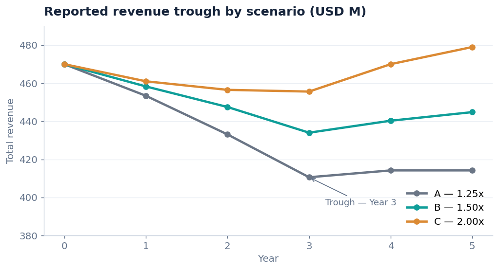
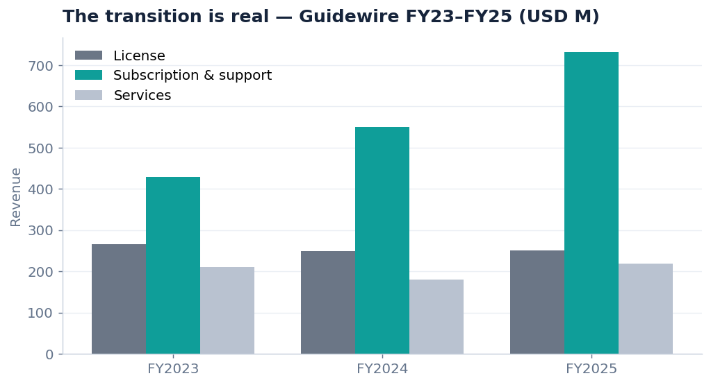
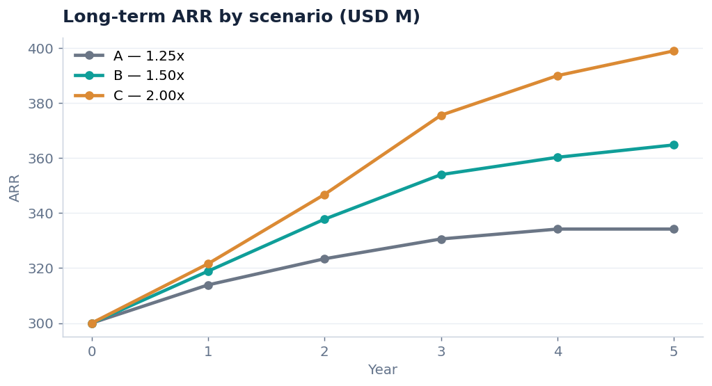
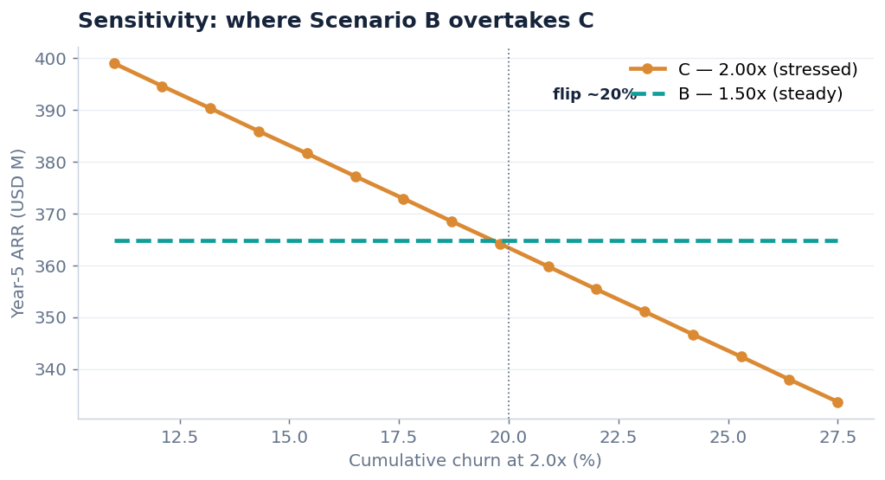

# Enterprise SaaS Pricing Transformation
### Perpetual-license → SaaS migration: conversion terms, pace & trough management

A pricing-analytics project that models how an insurance software platform vendor should migrate
its perpetual-license base to SaaS subscriptions — and on what commercial terms. The analytical
core is built entirely from **public company disclosures** (Guidewire, Sapiens, Duck Creek);
assumptions are isolated in a transparent, benchmark-bounded scenario layer.

**Stack:** PostgreSQL · Python (pandas) · Power BI · PowerPoint
**Decision supported:** not *whether* to migrate, but at what conversion multiple, over what
window — maximising long-term ARR while keeping the near-term revenue trough within board tolerance.

---

## The business question

Perpetual license revenue is recognised upfront; SaaS subscription is recognised ratably over the
term. So even a migration that increases lifetime value produces a **near-term reported-revenue
trough**. The question a CFO actually faces is the commercial structure: how aggressively to price
the conversion, and how fast to sunset perpetual — trading long-term ARR against the depth of that
trough.

Three migration paths are modelled, pricing the SaaS subscription as a multiple of prior annual
maintenance: **A = 1.25x, B = 1.50x, C = 2.00x**, each under a 36-month perpetual sunset.

---

## Key finding

Under base assumptions, **Scenario C (2.0x) leads on ARR, trough depth, and gross profit** — but
that lead survives only while cumulative churn at 2.0x stays below **~20%**. Above that threshold,
Scenario B overtakes.



> **Recommendation: Scenario B (1.5x) as the risk-adjusted base case** — it captures most of the
> ARR upside with a shallower, manageable trough and is robust even if price resistance runs high.
> **Scenario C is a conditional upside play**, justified only if a willingness-to-pay study confirms
> resistance below the flip point (credible here, since insurance core systems carry very high
> switching costs).

---

## Why this is credible — the transition is real

The model isn't invented; it reproduces a transition that a public company actually disclosed.
Guidewire's subscription & support revenue nearly doubled in two years while license stayed flat —
the perpetual-to-cloud shift, in real numbers.



Every figure in the analytical core is cited to a filing; figures inferred from a disclosed growth
rate are flagged `is_derived = TRUE` so the line between fact and inference is auditable.

---

## Results

**Long-term ARR** diverges as the conversion multiple rises — the reward for capturing more value
per conversion.



**But the answer hinges on one assumption.** Stress-testing price resistance at 2.0x shows exactly
where the recommendation flips from C to B — at roughly 20% cumulative churn (~4%/year).



| Scenario | Trough depth | Year-5 ARR | Year-5 gross profit | Year-5 blended GM |
|---|---|---|---|---|
| A — 1.25x | 12.6% | $334M | $239M | 57.7% |
| **B — 1.50x** | **7.7%** | **$365M** | **$263M** | **59.1%** |
| C — 2.00x | 3.1% | $399M | $290M | 60.5% |

A note the model makes explicit: a **revenue multiple is not a profit multiple**. SaaS carries
hosting COGS, so blended gross margin compresses from ~74% toward ~58–61% in every path — the
structural cost of cloud. The pricing decision doesn't prevent that; it determines how much ARR and
gross profit you capture despite it.

---

## Architecture — two layers

1. **Analytical core (disclosed & cited):** revenue by line, ARR, margins, retention — from filings.
2. **Scenario layer (assumptions, bounded):** conversion multiples, adoption pace, churn —
   isolated and bounded by published benchmarks (e.g. Duck Creek's disclosed 108–120% net retention).

Scenarios operate **on the disclosed base** and must reconcile to it — no synthetic carrier records.
See [`docs/methodology.md`](docs/methodology.md) for the provenance seam and reconciliation gates.

---

## Repository structure

| Path | Contents |
|---|---|
| `sql/02_public_data_schema.sql` | Disclosed-fact schema + scenario tables, seeded with verified figures. Runs and reconciles out of the box. |
| `sql/03_analytical_queries.sql` | Analytical queries (transition arc, mix, ARR walk, benchmark, provenance audit). |
| `sql/04_scenario_seed.sql` | Scenario definitions, generated by the model. |
| `python/scenario_model.py` | The migration model (A/B/C). Writes the projections and exports. |
| `python/sensitivity.py` | Price-resistance stress test → the flip point. |
| `python/make_readme_charts.py` | Regenerates the charts in this README. |
| `docs/source_inventory.md` | Every public source: fields, deliverable, target table, verified figures with citations. |
| `docs/methodology.md` | Provenance tiers, reconciliation gates, scoping decisions. |
| `exports/` | Model outputs (CSV) consumed by Power BI. |
| `powerbi/` | Dashboard build guide, DAX measures, and theme. |
| `presentation/pricing_strategy_deck.pptx` | 10-slide executive deck with the model's results. |
| `archive/` | Superseded synthetic-data draft, kept to show iteration. Not used. |

---

## How to run

**Analytical core (PostgreSQL):**
```bash
psql -d postgres -f sql/02_public_data_schema.sql        # create + seed
psql -d postgres -f sql/03_analytical_queries.sql        # analytical queries
```
Verify the disclosed base loaded:
```sql
SELECT f.revenue_line_code, f.amount_musd FROM fact_financials f
JOIN dim_fiscal_period p ON f.period_id = p.period_id
WHERE f.company_id = 1 AND p.fiscal_year = 2025 ORDER BY f.amount_musd DESC;
-- expect SUB_SUPPORT 731.30, LICENSE 251.90, SERVICES 219.20
```

**Scenario model (Python):**
```bash
cd python && pip install -r requirements.txt
python scenario_model.py     # -> exports/ + sql/04_scenario_seed.sql
python sensitivity.py        # -> exports/sensitivity_resistance.csv
python make_readme_charts.py # -> docs/images/*.png
```
The model prints trough depths of 12.6% / 7.7% / 3.1% for A/B/C and Year-5 ARR of 334 / 365 / 399.

---

---

## Executive presentation

A 10-slide strategy deck for CFO / Head of Pricing / Sales Leadership, populated with the model's
actual results: [`presentation/pricing_strategy_deck.pptx`](presentation/pricing_strategy_deck.pptx).

---

## Data sources

Anchored on **Guidewire (NYSE: GWRE)** — the most complete public example of an insurance software
vendor's perpetual-to-cloud transition — and corroborated by **Sapiens (NASDAQ: SPNS)** and
**Duck Creek** (historical; private since 2023). Full source register with citations in
[`docs/source_inventory.md`](docs/source_inventory.md).

## Roadmap

- [x] Source inventory & public-data schema (seeded, verified)
- [x] Analytical SQL queries
- [x] Scenario model + sensitivity analysis
- [x] Executive presentation
- [x] Power BI dashboard (built in Desktop; spec, DAX & theme in `powerbi/`)

## Disclaimer

Fictional-vendor framing; all core figures are grounded in public filings and cited. Scenario inputs
are explicit modelling assumptions, not forecasts. Not investment advice.