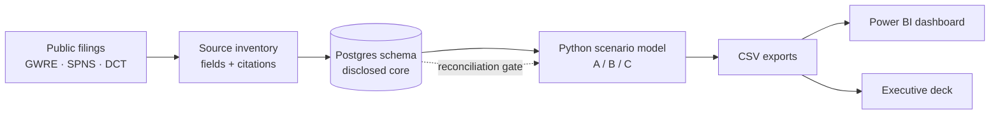
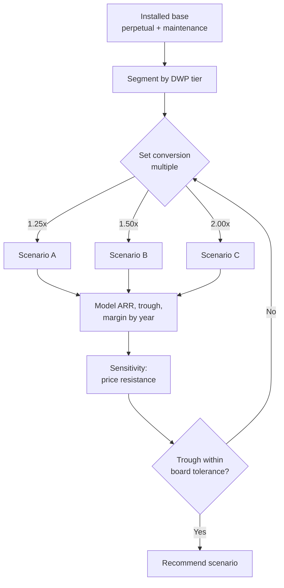
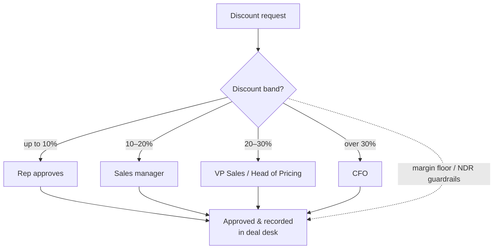

# Process Flows

Diagrams render natively on GitHub. Three flows: the solution data pipeline, the
migration-decision process, and the deal-desk discount-approval workflow.

## 1. Solution data flow (source → deliverable)

## 2. Migration-decision process

## 3. Deal-desk discount-approval workflow

